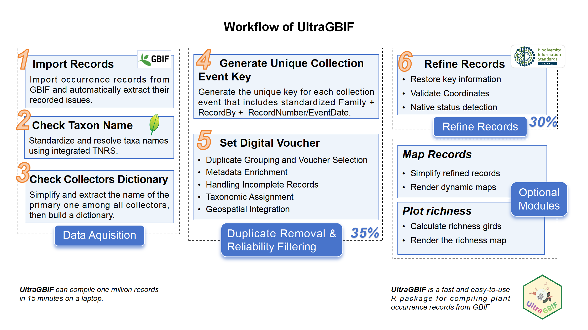

<a href="https://github.com/wyx619/UltraGBIF/"></a>

# UltraGBIF: Fast and Easy Compilation of GBIF Plant Occurrence Records in One R package

## Introduction

Mapping plant distributions is fundamental to understanding biodiversity patterns, accurate distribution data and such information is necessary for researching plant diversity. Global Biodiversity Information Facility, known as [GBIF](https://www.gbif.org/), is a large repository for plant occurrence records worldwide. It has fueled over 18,200 peer-reviewed journal articles, with ecology (3,769 researches), climate change (2,953), conservation (1,915), and invasive species management (1,840) as of August 2025, supporting global policy frameworks like the Kunming-Montreal Global Biodiversity Framework.

Researchers using GBIF occurrence records usually rely on a suite of packages and scrips, consuming lots of runtime, Such as [`rgbif`](https://doi.org/10.32614/CRAN.package.rgbif), [`TNRS`](https://doi.org/10.32614/CRAN.package.TNRS), [`CoordinateCleaner`](https://doi.org/10.32614/CRAN.package.CoordinateCleaner), [`bdc`](https://doi.org/10.32614/CRAN.package.bdc), [`plantR`](https://doi.org/10.1111/2041-210X.13779), [`NSR`](https://doi.org/10.32614/CRAN.package.NSR) and [`GVS`](https://doi.org/10.32614/CRAN.package.GVS) help to deal with GBIF occurrence records. Moreover, for million records datasets, current methods incur substantial computational overhead through manual chaining of disparate packages, necessitating high-performance infrastructure despite advancing computational capabilities.

To rectify this situation, we introduce UltraGBIF, an efficient R package that unifies taxonomic resolution, spatial validation, duplicate consolidation, and botanical region annotation within a high-performance framework. Its optimized C/CPP-based dependencies, practical vectorized programming methods leveraging the SIMD instruction sets of modern computer CPUs and intelligent parallelization enable compiling one million GBIF occurrence records on a laptop within 15 minutes. In a word, UltraGBIF resolves challenges in reproducibility, scalability, and spatial-taxonomic integrity without increasing adoption barriers for biodiversity researchers.

## Workflow

***4 stages and 8 modules of UltraGBIF.** After core stages (module 1\~6), generally 30% of the initial occurrence records are retained.* 

UltraGBIF provides a reproducible, plant-optimized, and computationally efficient framework for transforming raw GBIF occurrence records into analysis-ready datasets. The package functions are categorized into 4 stages and 8 distinct modules.

**Stage 1: Data Acquisition**

This stage ensures data accuracy and consistency through three modules:

1.  Import Records: This module receives a path to the zip file downloaded from GBIF. After loading all initial occurrence records, their issue flags are automatically extracted for downstream quality assessment.

2.  Check Taxon Name: This module implements taxonomic name standardization to resolve and validate plant names by the [Taxonomic Name Resolution Service](https://doi.org/10.32614/CRAN.package.TNRS) (TNRS, Boyle et al. 2013), which unifies synonyms and corrects misspellings.

3.  Check Collector Name: This module simplifies and extracts the name of the primary one among all collectors, then builds a dictionary to reduce inconsistencies that can fragment single collection events. This module reduces identification errors and improves the accuracy of subsequent duplication checks.

**Stage 2: Duplicate Removal and Reliability Filtering**

This stage improves data reliability by identifying high-quality, non-redundant occurrence records.

4.  Generate Unique Collection Mark: This module identifies and consolidates duplicates into unique collection events. A collection event represents a distinct sampling instance (a specific collector at a specific date or with a record number). Specifically, the collection event key/mark includes standardized `Family + RecordBy + RecordNumber/EventDate`.

5.  Set Digital Voucher: Records possessing a 'full collection mark' (defined as the combination of standardized `Family + RecordBy + RecordNumber/EventDate`) are grouped, and those within each group are scored across multiple dimensions. The record exhibiting the highest metadata quality is retained as the 'digital voucher.' Conversely, records lacking any component of this definition are treated as unique entities; each serves as its own grouping unit and proceeds directly to the multi-dimensional scoring phase without aggregation. This strategy preserves the most geographically informative data while minimizing redundancy, thereby enhancing spatial reliability.

**Stage 3: Refine Records**

This stage restores key information for usable records from their duplicates with the same collection mark, enhances geospatial accuracy, and extracts the native status information of occurrence records.

6.  Refine records: This module validates spatial information and restores detailed metadata for usable vouchers. It performs automated coordinate validation using CoordinateCleaner (Zizka et al., 2019) to flag spatial errors (e.g., centroids, capitals, institutions). It also extracts native status information to set records as native or others.

**Optional Stages**

-   Map records: An optional visualization module that renders verified records onto customizable, dynamic maps, providing an intuitive interface for viewing spatial distributions and data density.

-   Plot richness: This optional module is useful for creating a simple richness map from UltraGBIF-processed occurrence records above. It has drawn on `lets.presab.points` and `plot.PresenceAbsence` from R package [`letsR`](https://github.com/macroecology/letsR)(Vilela and Villalobos 2015), but fully leverages vectorization techniques to avoid looping when filling large matrices, thus achieving nearly a hundredfold speedup.

Focused exclusively on GBIF plant occurrence records, UltraGBIF can compile one million records within 15 minutes on a laptop without high memory usage. In a word, UltraGBIF integrates these components into a unified, automated workflow that enhances data standardization, accuracy, and usability, which enables robust, reproducible, and scalable compiling of GBIF occurrence records for advanced biodiversity research.

## Installation

UltraGBIF will be available on CRAN soon. In the meantime you can quickly install UltraGBIF via my temporary CRAN-self-hosted repository by [Drat](https://doi.org/10.32614/CRAN.package.drat) R Archive Template using the two commands below.

``` r
options(repos = c(getOption("repos"),"https://anonymous.4open.science/r/Repo-902F"))
install.packages("UltraGBIF") ## install UltraGBIF in one minute
```

## Tutorial of UltraGBIF

A comprehensive tutorial is available after installation at:

``` r
library(UltraGBIF)
vignette('Tutorial_of_UltraGBIF',package = 'UltraGBIF')
```

## Minimal Complete Workflow

The following code demonstrates the complete UltraGBIF workflow from data import to richness mapping:

``` r
# Step 1: Import GBIF occurrence records
occ_import <- import_records(
  GBIF_file = "path/to/gbif_download.zip",
  only_PRESERVED_SPECIMEN = TRUE
)

# Step 2: Standardize taxonomic names
taxa_checked <- check_occ_taxon(
  occ_import = occ_import,
  accuracy = 0.9
)

# Step 3: Standardize collector names
collectors_dictionary <- check_collectors(
  occ_import = occ_import,
  min_char = 2
)

# Step 4: Generate collection event keys
collection_key <- set_collection_mark(
  occ_import = occ_import,
  collectors_dictionary = collectors_dictionary
)

# Step 5: Select digital vouchers
voucher <- set_digital_voucher(
  occ_import = occ_import,
  taxa_checked = taxa_checked,
  collection_key = collection_key
)

# Step 6: Refine records (coordinate validation + native status)
refined_records <- refine_records(
  voucher = voucher,
  threads = 4,
  save_path = getwd()
)

# Optional: Visualize results
map_records(refined_records = refined_records, precision = 4, cex = 4)
richness <- plot_richness(refined_records = refined_records,
                          main = "Species Richness")
```

## Performance

UltraGBIF achieves outstanding performance through specific technical architectures:

-   **C/C++ Backend Integration**: Leverages `data.table`, `stringi`, and `terra`, all implemented in C/C++
-   **Vectorization Over Explicit Loops**: Bypasses R's interpretive overhead by dispatching to pre-compiled routines
-   **SIMD Exploitation**: Vectorized operations enable compiler-level SIMD auto-vectorization
-   **Memory-Efficient Design**: In-place modification (`set()`, `:=`) eliminates intermediate copies
-   **Chunk-Based Parallelization**: Vectorized processing within chunks, parallel execution across chunks

On a standard laptop, UltraGBIF can compile one million occurrence records within 15 minutes.

## Reference

Appelhans, Tim, Florian Detsch, Christoph Reudenbach, and Stefan Woellauer. 2023. “Mapview: Interactive Viewing of Spatial Data in r.” <https://CRAN.R-project.org/package=mapview>.

Boyle, Brad, Nicole Hopkins, Zhenyuan Lu, Juan Antonio Raygoza Garay, Dmitry Mozzherin, Tony Rees, Naim Matasci, et al. 2013. “The Taxonomic Name Resolution Service: An Online Tool for Automated Standardization of Plant Names.” *BMC Bioinformatics* 14 (1): 16. <https://doi.org/10.1186/1471-2105-14-16>.

Chirico, Michael. 2023. “geohashTools: Tools for Working with Geohashes.” <https://CRAN.R-project.org/package=geohashTools>.

De Melo, Pablo Hendrigo Alves, Nadia Bystriakova, Eve Lucas, and Alexandre K. Monro. 2024. “A New R Package to Parse Plant Species Occurrence Records into Unique Collection Events Efficiently Reduces Data Redundancy.” *Scientific Reports* 14 (1): 5450. <https://doi.org/10.1038/s41598-024-56158-3>.

Vilela, Bruno, and Fabricio Villalobos. 2015. “letsR: A New R Package for Data Handling and Analysis in Macroecology.” Edited by Timothée Poisot. *Methods in Ecology and Evolution* 6 (10): 1229–34. <https://doi.org/10.1111/2041-210x.12401>.

Zizka, Alexander, Daniele Silvestro, Tobias Andermann, Josué Azevedo, Camila Duarte Ritter, Daniel Edler, Harith Farooq, et al. 2019. “CoordinateCleaner : Standardized Cleaning of Occurrence Records from Biological Collection Databases.” Edited by Tiago Quental. *Methods in Ecology and Evolution* 10 (5): 744–51. <https://doi.org/10.1111/2041-210X.13152>.

Mullen, Lincoln A., Kenneth Benoit, Os Keyes, Dmitry Selivanov, andJeffrey Arnold. 2018. “Fast, Consistent Tokenization of NaturalLanguage Text” 3: 655. <https://doi.org/10.21105/joss.00655>.
