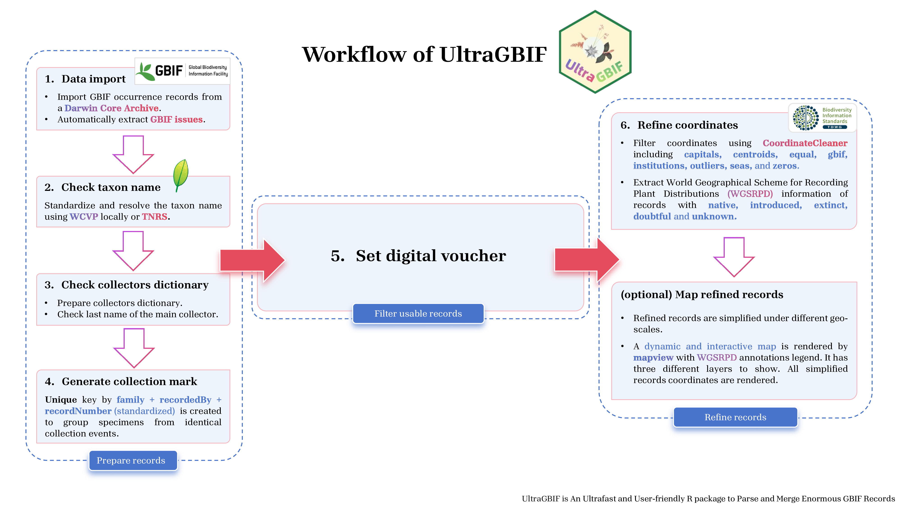
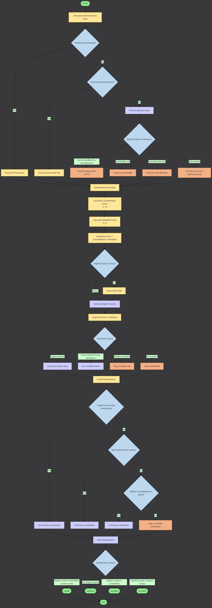

## Introduction of **UltraGBIF** 

Mapping plant distributions is fundamental to understanding biodiversity patterns and advancing conservation efforts, providing the foundation for assessing species vulnerability, habitat integrity, and ecosystem resilience. Moreover, accurate distribution data are critical for identifying biodiversity hotspots, evaluating anthropogenic impacts, and predicting plant responses to climate change. Such information is necessary for evidence-based conservation planning and effective management of plant diversity.

Among the most influential databases, the Global Biodiversity Information Facility (GBIF) stands out as the largest and most comprehensive open-access repository for plant occurrence records and facilitates the integration of millions of geo-referenced biodiversity records contributed by museums, herbaria, and individual researchers worldwide. GBIF also stands as a cornerstone of international biodiversity informatics, functioning as a global network and data infrastructure dedicated to democratizing open access to comprehensive biodiversity data for exploring climate change, biodiversity loss, and ecosystem degradation.

Researches using GBIF records are often supported by a suite of open-source analytical tools and software. **R**, with packages such as `rgbif`[@rgbif], `TNRS`[@TNRS] , `sf`[@sf], `terra`[@terra],, `CoordinateCleaner`[@CoordinateCleaner], and WCVP[@rWCVPdata], has become the standard for biodiversity data integration, analysis, and modeling. These tools enable researchers to efficiently access, process, and analyze large datasets, facilitating everything from plants distribution modeling to assessments of functional diversity and biogeographic patterns.

GBIF hosts over 500 million records for [*Tracheophyta*](https://www.gbif.org/occurrence/search?taxon_key=7707728&occurrence_status=present), a foundational group for terrestrial ecosystems and a key focus in ecological, biogeographic, and evolutionary research. However, despite its great value in recording species distribution, GBIF data often inherit taxonomic inaccuracies, spatial biases, and incomplete records from source datasets, primarily due to historical inconsistencies in specimen collection, unresolved synonymy, and uneven sampling efforts. Moreover, it is always a significant challenge for ordinary researchers to deal with such large-scale data. Traditional methods require substantial time and effort, involve calling multiple different tools, and sometimes necessitate the use of expensive professional servers.

To address these limitations, we present UltraGBIF, an ultrafast and user-friendly R package designed for efficient parsing and merging of GBIF records. UltraGBIF is inspired by ParseGBIF[@demelo2024] and guided by the design principles of accessibility, computational efficiency, and optimal resource utilization. UltraGBIF achieves unprecedented processing speed and user convenience through a sophisticated technical architecture grounded in some principles: ultrafast computation, memory efficiency, intelligent parallelization, and user-centric design. These innovations collectively enable processing of million-record datasets on laptops within minutes, which means 100x faster than alternative approaches..

## Workflow of UltraGBIF



The figure shows how UltraGBIF makes rapid processing of GBIF occurrence records, while maintaining rigorous quality control standards. Focused exclusively on plant data, it streamlines the cleaning, filtering, and standardization of GBIF-derived records, ensuring high data integrity and consistency for downstream analyses such as species distribution modeling, biodiversity assessments, and macro-ecological studies. UltraGBIF comprises six core functions that constitute a complete and coherent workflow, which can be categorized into the following 5 components.

1.  **`Taxon Name Resolution`** This section includes a taxonomic standardization step to resolve and validate scientific names of plant taxa. This is achieved by referencing the World Checklist of Vascular Plants, a comprehensive and authoritative global resource. Alternatively, the online Taxonomic Name Resolution Service (TNRS), which has been built in following the protocol of Maitner and Boyle (2024), can be used to automatically match and correct taxon names against multiple taxonomic databases. This ensures consistent and accurate species identification, a critical prerequisite for reliable biodiversity analyses and cross-dataset integration.

2.  **`Reduce Duplicate Records`** To enhance data efficiency and analytical accuracy, this section identifies and consolidates duplicate records into unique collection events, ensuring that each event represents a distinct sampling or observation instance. Among duplicate entries, the record with the highest score is retained. This approach preserves the most geographically informative data while minimizing redundancy, thereby improving the quality and reliability of downstream spatial and ecological analyses.

3.  **`Data Quality Evaluation`** This section evaluates the validity and spatial accuracy of each record using the GBIF standardized issue flagging system. This built-in quality control mechanism identifies potential errors or inconsistencies in occurrence data, such as problematic coordinate formatting, spatial mismatches, or taxonomic discrepancies. Records are flagged based on severity, enabling users to apply customized filtering thresholds depending on the requirements of downstream analyses. This step ensures that only high-quality, spatially reliable data are retained for subsequent processing and interpretation. See more details as below.

    

4.  **`Coordinate Verification & WGSRPD information extraction`** This section performs automated coordinate validation by CoordinateCleaner(Zizka et al. 2019) and [WGSRPD](http://www.tdwg.org/standards/109) information extraction of taxons *(native/introduced/extinct/location_doubtful)*.

5.  **`Map and Visualization`** This optional section enables these processed distribution data with WGSRPD information to be mapped onto a highly customizable dynamic map, thereby providing the most intuitive visualization of their spatial distributions and offering a streamlined interface for biodiversity research.

**Note:** UltraGBIF is still under **development**. If you encounter any bugs, please feel free to submit an [issue](https://github.com/wyx619/UltraGBIF/issues/new). Your feedback is greatly appreciated!

UltraGBIF is able to clean one million records within 30 minutes on laptops (8 threads, 32 GB RAM), representing 100x faster improvement and 60% memory reduction compared to conventional approaches. By enabling rapid, efficient, and reproducible access to deal with GBIF plants records, UltraGBIF democratizes large-scale plant biodiversity research across macroecology, conservation biology, and global change studies.

## Installation

UltraGBIF can be conveniently installed directly from its GitHub repository, which ensures access to the latest version and all available features:

```{r}
## require good internet to Github
options(timeout = 600) ## Deal with unstable network connections
install.packages("UltraGBIF", repos=c("https://wyx619.github.io/UltraGBIF619",getOption("repos")))
```

UltraGBIF runs with rWCVPdata, which will be installed automatically if you have never installed it. **If you meet any internet error**, just try to download [rWCVPdata](https://wyx619.github.io/UltraGBIF619/src/contrib/rWCVPdata_0.6.0.tar.gz)(Click on the hyperlink) directly and install it manually:

```{r}
options(timeout = 600) ## Deal with unstable network connections
install.packages("rWCVPdata_0.6.0.tar.gz", repos = NULL) ## install rWCVPdata from the local file you have downloaded.
install.packages("UltraGBIF", repos="https://wyx619.github.io/UltraGBIF619") ## then continue installing UltraGBIF
```

We recommend rWCVPdata version 0.6.0 with WCVP version 14 for UltraGBIF, and please note that the initial installation may take some time; kindly allow it to complete without interruption.

## Reference

Boyle, Brad, Nicole Hopkins, Zhenyuan Lu, Juan Antonio Raygoza Garay, Dmitry Mozzherin, Tony Rees, Naim Matasci, et al. 2013. “The Taxonomic Name Resolution Service: An Online Tool for Automated Standardization of Plant Names.” *BMC Bioinformatics* 14 (1): 16. <https://doi.org/10.1186/1471-2105-14-16>.

De Melo, Pablo Hendrigo Alves, Nadia Bystriakova, Eve Lucas, and Alexandre K. Monro. 2024. “A New R Package to Parse Plant Species Occurrence Records into Unique Collection Events Efficiently Reduces Data Redundancy.” *Scientific Reports* 14 (1): 5450. <https://doi.org/10.1038/s41598-024-56158-3>.

Govaerts, Rafaël, Eimear Nic Lughadha, Nicholas Black, Robert Turner, and Alan Paton. 2021. “The World Checklist of Vascular Plants, a Continuously Updated Resource for Exploring Global Plant Diversity.” *Scientific Data* 8 (1): 215. <https://doi.org/10.1038/s41597-021-00997-6>.

Maitner, Brian, and Brad Boyle. 2024. “TNRS: Taxonomic Name Resolution Service.” [https://CRAN.R-project.org/package=TNRS](https://cran.r-project.org/package=TNRS).

Zizka, Alexander, Daniele Silvestro, Tobias Andermann, Josué Azevedo, Camila Duarte Ritter, Daniel Edler, Harith Farooq, et al. 2019. “CoordinateCleaner : Standardized Cleaning of Occurrence Records from Biological Collection Databases.” Edited by Tiago Quental. *Methods in Ecology and Evolution* 10 (5): 744–51. <https://doi.org/10.1111/2041-210X.13152>.
