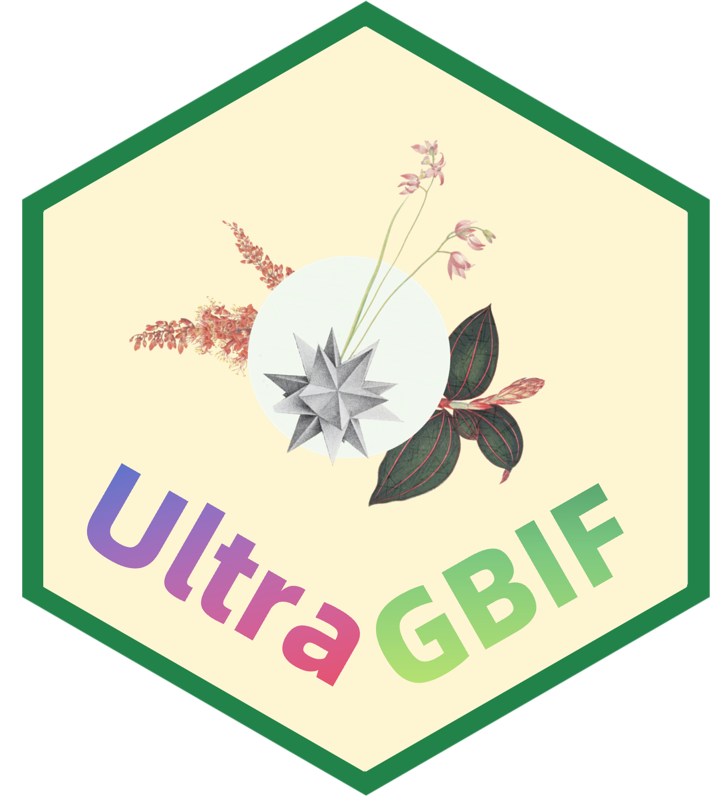

## Introduction of **UltraGBIF** {width="58"}

Understanding and mapping species distributions is fundamental to biodiversity conservation, as it underpins critical assessments of species vulnerability, habitat integrity, and ecosystem resilience. Precise distribution data enable the identification of biodiversity hotspots, quantification of anthropogenic impacts, and predictive modeling of range shifts under climate change. However, existing biodiversity databases, including GBIF, often contain taxonomic inaccuracies, spatial biases, and incomplete records due to historical inconsistencies, synonymy issues, or uneven sampling efforts. These limitations compromise the reliability of downstream analyses, leading to flawed conservation prioritization, misdirected resource allocation, and ineffective policy decisions.

The goal of UltraGBIF is to parse and merge enormous [Global Biodiversity Information Facility (GBIF)](https://www.gbif.org/) occurrence data in Darwin-Core-Archive efficiently. GBIF is the largest biodiversity data repository around the world, hosting over **492 million** occurrence records for [*Tracheophyta*](https://www.gbif.org/occurrence/search?taxon_key=7707728&occurrence_status=present). However, data integration from heterogeneous databases often introduces redundancy and errors, which can compromise the accuracy of species richness measurements and subsequently affect ecological, biogeographic, and evolutionary studies. Moreover, processing massive occurrence datasets typically involves cumbersome workflows and time-consuming operations, posing significant challenges for researchers.

To address these limitations, we present UltraGBIF – an ultra-fast and user-friendly tool designed for efficient parsing and merging GBIF occurrence data in Darwin-Core-Archive. Inspired by ParseGBIF[@demelo2024] and guided by the design principles of accessibility, computational efficiency, and optimal resource utilization, UIltraGBIF implements an integrated workflow comprising 5 key modules as below.

1.  **`Taxon Name Resolution`** Standardize and resolve the taxon name using the World Checklist of Vascular Plants[@govaerts2021], or using TNRS[@boyle2013] which has been integrated[@TNRS].

2.  **`Reduce Duplication of Records`** Collates duplicate records into unique "collection events" while retaining spatial data entries with maximal completeness.

3.  **`Data Quality Evaluation`** Assesses record validity and spatial data quality through GBIF standardized issue flagging system.

4.  **`Coordinate Verification & Occurrence Status Annotation`** Performs automated coordinate validation via CoordinateCleaner [@zizka2019] integration, complemented by WCVP-[WGSRPD](https://www.tdwg.org/standards/wgsrpd/)-based[@govaerts2021] annotations for species occurrence status (native/introduced/extinct/location_doubtful/unknown[)]{.underline}.

5.  **`Map and Visualization`** This optional module enables the processed species distribution data (including different [WGSRPD](https://www.tdwg.org/standards/wgsrpd/) attributions) to be mapped onto a highly customizable dynamic map, thereby providing the most intuitive visualization of their spatial distributions and offering a streamlined interface for biodiversity research. Additionally, the results can be readily

This unified pipeline/workflow enables rapid processing of different datasets while maintaining rigorous quality control standards.

**Note:** UltraGBIF is currently under **active development**. If you encounter any bugs during use, please feel free to submit an issue. Your feedback is greatly appreciated!

## Installation

You can install UltraGBIF like so:

``` r
if (!requireNamespace("rWCVPdata",quietly = TRUE)) {
  install.packages("rWCVPdata", repos=c("https://matildabrown.github.io/drat",getOption("repos")))
}
if (!requireNamespace("remotes",quietly = TRUE)) {
  install.packages("remotes")
  }
remotes::install_github("wyx619/UltraGBIF")
```

## Reference
